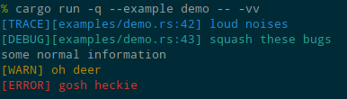

# yall: Yet Another Little Logger

A simple lightweight backend for the [`log`](https://crates.io/crates/log) crate.

  * Logs to stderr
  * Simple standard terminal colors, no RGB or 256-color themes that may clash with the
    terminal theme
  * Info level messages are unformatted with no color or prefix
  * Error/Warn/Debug/Trace messages are Red/Yellow/Cyan/Blue, respectively
  * Debug and Trace levels show the filename and line number.
  * Minimal dependencies
  * Configured with code rather than environment variables

## Style Example

Standard ANSI colors on a Solarized Dark terminal theme.

## License

Copyright 2020 Allen Wild

Dual-licensed as MIT or Apache 2.0. See the [LICENSE-MIT](LICENSE-MIT) and
[LICENSE-APACHE](LICENSE-APACHE) files for details.
